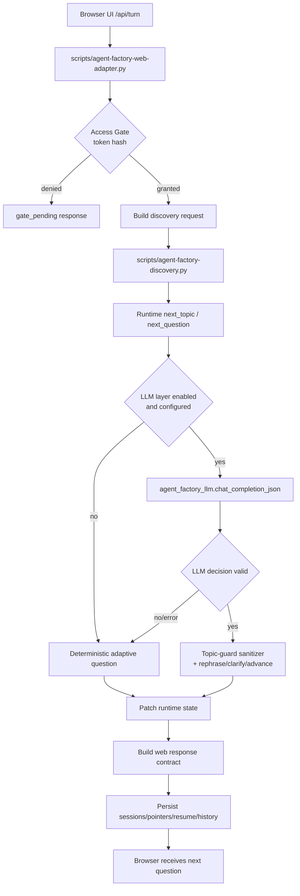

# Agent Factory Web Demo: LLM Orchestration (MVP0)

## Purpose

Документ фиксирует runtime-архитектуру web-first demo, где фабричный агент-архитектор Moltis ведёт discovery-диалог с business-пользователем через LLM decision layer, но остаётся устойчивым при ошибках провайдера.

## Runtime Flow

## Decision Layer Contract

LLM возвращает строго JSON:

- `decision`: `accept|clarify|rephrase|advance`
- `next_topic`
- `next_question`
- `low_signal`
- `topic_summary`

Server-side guardrails:

1. Тема ограничена только `ARCHITECT_TOPIC_FRAMES`.
2. Переход темы допускается только в пределах `current | runtime_next | next_by_order`.
3. При invalid/empty/timeout ответе LLM включается fail-soft fallback в deterministic path.
4. В UI не уходят внутренние коды ошибок LLM.

## Environment Contract

Ключи для LLM decision layer:

- `ASC_DEMO_LLM_ENABLED`
- `OPENAI_API_KEY`
- `OPENAI_BASE_URL`
- `MODEL_NAME`
- `ASC_DEMO_LLM_TIMEOUT_SECONDS`
- `ASC_DEMO_LLM_TEMPERATURE`
- `ASC_DEMO_LLM_MAX_TOKENS`

Рекомендованный Fireworks baseline:

- `OPENAI_BASE_URL=https://api.fireworks.ai/inference/v1`
- `MODEL_NAME=accounts/fireworks/models/glm-5`

## Failure Behavior

При любых LLM сбоях (`HTTP`, timeout, invalid JSON):

- web session не прерывается;
- текущий discovery topic не теряется;
- следующий вопрос строится deterministic composer-ом;
- health endpoint продолжает отвечать `200` с признаком `llm_configured=false/true`.
