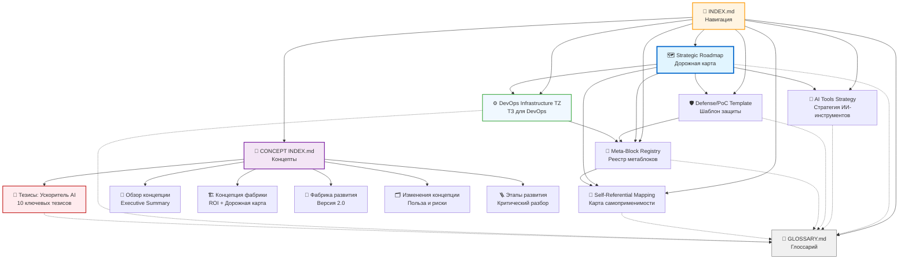

# Навигация по документации ASC AI Fabrique

**Версия**: 1.3.0  
**Дата обновления**: 2026-03-11  
**Статус документации**: В разработке (навигация обновлена с учетом пакета ASC AI Fabrique 2.0)

---

## Обзор проекта

**ASC AI Fabrique** — это система автоматического самовоспроизводящегося и самосовершенствующегося разработки, построенная на базе роя ИИ-агентов. Проект представляет собой «фабрику агентов», способную создавать специализированных ИИ-агентов для оптимизации различных бизнес-процессов в финтех-корпорации.

Ключевая особенность системы — **самоприменимость**: роевая система не только создает ИИ-агентов, но и использует их для собственного развития и улучшения. Проект разработан с учетом жестких требований безопасности российского финтех-сектора и строгих временных ограничений (MVP0 за ≤4 недели).

Документация охватывает трёхфазную стратегию развития: от быстрого прототипа (Фаза 0) через масштабирование команды агентов (Фаза 1) до полностью автономной работы (Фаза 2).

---

## Быстрый старт

**Впервые знакомитесь с проектом?** Начните с пути быстрого ознакомления:

1. ⚡ Прочтите раздел [Карта документов](#карта-документов) ниже (1 мин)
2. 🗺️ Откройте [Strategic Roadmap - Миссия](./strategic_roadmap.md#миссия-проекта) (2 мин)
3. 📖 Изучите 5 ключевых терминов в [GLOSSARY.md](./GLOSSARY.md) (3 мин):
   - ASC AI Fabrique
   - Метаблок
   - Агент-разработчик
   - Defense Gate
   - MVP0

**Общее время**: 5-10 минут  
**Результат**: Вы поймете суть проекта и сможете выбрать подходящий путь для углубленного изучения.

### Актуальный execution-plan по web demo

- [Master Plan: ASC Demo Clean-Room Parity & Stabilization](../plans/asc-demo-clean-room-parity-implementation-master-plan.md) — главный план стабилизации `demo.ainetic.tech`, логики фабрики и UX/UI parity

---

## Карта документов

Визуальная схема связей между документами проекта:

**Условные обозначения**:
- `-->` Сплошная стрелка = Прямая ссылка/зависимость
- `-.->` Пунктирная стрелка = Ссылка на глоссарий (вспомогательная)
- 🔵 Синий фон = Центральный документ
- 🟠 Оранжевый фон = Навигационный документ
- 🟢 Зеленый фон = Технический документ
- ⚪ Серый фон = Справочный документ

---

## Основные артефакты

### [🗺️ Стратегическая дорожная карта](./strategic_roadmap.md)

**Тип**: Strategic  
**Версия**: 1.0.0  
**Статус**: Final  
**Объем**: ~30 страниц / 493 строки  
**Сложность**: 🟡 Средняя  
**Время чтения**: 35-40 минут  
**Последнее обновление**: 2025-10-28

**Описание**: Трёхфазная дорожная карта разработки ASC AI Fabrique от MVP0 (<4 недель) до полностью автономной системы. Включает детальные вехи для Фазы 0 (17 вех), высокоуровневые Program Increments для Фазы 1 (6 PI) и стратегические цели Фазы 2. Содержит таймлайны, зависимости, критерии успеха и адаптивный механизм корректировки.

**Ключевые разделы**:
- [Миссия проекта](./strategic_roadmap.md#миссия-проекта)
- [Фаза 0: Быстрое прототипирование MVP0](./strategic_roadmap.md#фаза-0-быстрое-прототипирование-mvp0-4-недель)
- [Фаза 1: Масштабирование команды](./strategic_roadmap.md#фаза-1-масштабирование-команды-3-6-месяцев)
- [Фаза 2: Автономная работа](./strategic_roadmap.md#фаза-2-автономная-работа-непрерывно)
- [Адаптивный механизм](./strategic_roadmap.md#адаптивный-механизм-дорожной-карты)

**Для кого**: Все аудитории — разработчики, менеджеры проектов, архитекторы, руководство

---

### [🔧 Стратегия ИИ-инструментов](./ai_tools_strategy.md)

**Тип**: Tactical  
**Версия**: 1.0.0  
**Статус**: Final  
**Объем**: ~12 страниц / 228 строк  
**Сложность**: 🟡 Средняя  
**Время чтения**: 15-20 минут  
**Последнее обновление**: 2025-10-28

**Описание**: Детальная методология исследования, оценки и выбора ИИ-инструментов для ускорения разработки по 6 категориям задач (Research, Architecture, Coding, Testing, Documentation, Presentation). Включает критерии отбора, процесс бенчмаркинга, матрицы решений и ожидаемые метрики ускорения (от 2x до 10x).

**Ключевые разделы**:
- [Обзор методологии](./ai_tools_strategy.md#обзор)
- [1. Исследование](./ai_tools_strategy.md#1-исследование)
- [2. Архитектура](./ai_tools_strategy.md#2-архитектура)
- [3. Кодирование](./ai_tools_strategy.md#3-кодирование)
- [4. Тестирование](./ai_tools_strategy.md#4-тестирование)
- [5. Документация](./ai_tools_strategy.md#5-документация)
- [6. Презентация](./ai_tools_strategy.md#6-презентация)

**Для кого**: Технические лиды, разработчики, DevOps-инженеры, руководители направлений

---

### [🛡️ Шаблон защиты/доказательства концепции](./defense_poc_template.md)

**Тип**: Template  
**Версия**: 1.0.0  
**Статус**: Final  
**Объем**: ~11 страниц / 226 строк  
**Сложность**: 🟢 Низкая  
**Время чтения**: 10-15 минут  
**Последнее обновление**: 2025-10-28

**Описание**: Пятифазный шаблон для подготовки и проведения защит (Defense Gates) и презентаций PoC. Включает детальные чек-листы, рекомендации по созданию демо, риск-менеджмент и процедуру follow-up. Описывает метаблок POC_DEFENSE_PATTERN для автоматизации процесса защиты через ИИ-агентов.

**Ключевые разделы**:
- [Обзор процесса защиты](./defense_poc_template.md#обзор)
- [Фаза 1: Подготовка](./defense_poc_template.md#фаза-1-подготовка)
- [Фаза 4: Презентация](./defense_poc_template.md#фаза-4-презентация)
- [Метаблок POC_DEFENSE_PATTERN](./defense_poc_template.md#метаблок-poc_defense_pattern)

**Для кого**: Менеджеры проектов, презентаторы, технические лиды, стейкхолдеры

---

### [🧩 Реестр метаблоков](./meta_block_registry.md)

**Тип**: Reference  
**Версия**: 1.0.0  
**Статус**: Final  
**Объем**: ~25 страниц / 540 строк  
**Сложность**: 🔴 Высокая  
**Время чтения**: 25-30 минут  
**Последнее обновление**: 2025-10-28

**Описание**: Техническая спецификация реестра метаблоков — переиспользуемых паттернов для создания ИИ-агентов. Включает JSON-схему метаблока, описание 7 семенных паттернов (RESEARCH_FRAMEWORK_PATTERN, ARCHITECTURE_PATTERN, DEVELOPMENT_PATTERN и др.), руководство по извлечению новых паттернов из успешных практик и применению существующих.

**Ключевые разделы**:
- [Схема реестра метаблоков](./meta_block_registry.md#схема-реестра-метаблоков)
- [Семенные паттерны (7 шт)](./meta_block_registry.md#семенные-паттерны-seed-patterns)
- [Руководство по извлечению паттернов](./meta_block_registry.md#руководство-по-извлечению-паттернов)
- [Руководство по применению](./meta_block_registry.md#руководство-по-применению-метаблоков)

**Для кого**: Архитекторы, разработчики ИИ-агентов, технические специалисты

---

### [🔄 Карта самоприменимости](./self_referential_mapping.md)

**Тип**: Mapping  
**Версия**: 1.0.0  
**Статус**: Final  
**Объем**: ~13 страниц / 235 строк  
**Сложность**: 🟡 Средняя  
**Время чтения**: 15-20 минут  
**Последнее обновление**: 2025-10-28

**Описание**: Демонстрация самоприменимости ASC AI Fabrique через отображение задач создания дорожной карты на роли ИИ-агентов и метаблоки. Содержит таблицу mapping (8+ типов задач), метрики автономности (0-100%), критерии готовности к автономной работе и план эволюции от ручной работы к полной автоматизации.

**Ключевые разделы**:
- [Таблица отображения задач](./self_referential_mapping.md#таблица-отображения)
- [Метрики автономности](./self_referential_mapping.md#метрики-автономности)
- [Эволюция автономности](./self_referential_mapping.md#эволюция-автономности)

**Для кого**: Архитекторы систем, технические лиды, исследователи ИИ

---

### [⚙️ ТЗ для DevOps: Настройка GPU-сервера](./devops_infrastructure_tz.md)

**Тип**: Technical
**Версия**: 1.0.0
**Статус**: Final
**Объем**: ~15 страниц / 350 строк
**Сложность**: 🟡 Средняя
**Время чтения**: 20-25 минут
**Последнее обновление**: 2026-01-19

**Описание**: Техническое задание для команды DevOps по настройке сервера с 8× GPU для запуска инференса модели GLM-4.7 (355B MoE, 200K контекст). Включает формальный запрос к подразделению ЦОД, спецификации модели, конфигурации vLLM, Docker Compose файлы, интеграцию с Claude Code CLI, требования безопасности и мониторинга.

**Ключевые разделы**:
- [Запрос к подразделению ЦОД](./devops_infrastructure_tz.md#часть-1-запрос-к-подразделению-предоставляющему-цод)
- [Технические спецификации GLM-4.7](./devops_infrastructure_tz.md#часть-2-технические-спецификации-glm-47)
- [Настройка vLLM](./devops_infrastructure_tz.md#часть-3-настройка-vllm-для-glm-47)
- [Интеграция с Claude Code CLI](./devops_infrastructure_tz.md#часть-5-интеграция-с-claude-code-cli)
- [Порядок выполнения работ](./devops_infrastructure_tz.md#часть-8-порядок-выполнения-работ)

**Для кого**: DevOps-инженеры, системные администраторы, технические лиды

---

## Рекомендуемые пути чтения

Выберите путь в зависимости от вашей роли и целей:

### 🚀 Путь новичка (Quick Start Path)

**Для кого**: Новые члены команды, незнакомые с проектом  
**Цель**: Понять ЧТО это, ЗАЧЕМ нужно, КАК начать работу  
**Общее время**: 15-25 минут

**Последовательность чтения**:
1. [Дорожная карта - Обзор](./strategic_roadmap.md#обзор) — 3 мин
2. [Дорожная карта - Миссия](./strategic_roadmap.md#миссия-проекта) — 2 мин
3. [GLOSSARY - Первые 10-15 терминов](./GLOSSARY.md) — 5 мин
4. [Стратегия ИИ - Обзор](./ai_tools_strategy.md#обзор) — 3 мин
5. [Стратегия ИИ - Категории задач (обзор всех 6)](./ai_tools_strategy.md) — 5 мин
6. [Шаблон защиты - Обзор](./defense_poc_template.md#обзор) — 2 мин

**Результат**: Вы можете объяснить проект в 2-3 предложениях, назвать 3 ключевых компонента и понимаете, зачем нужны Defense Gates.

---

### 💻 Путь разработчика (Technical Path)

**Для кого**: Разработчики, архитекторы, технические лиды
**Цель**: Понять архитектуру системы, метаблоки и начать разработку
**Общее время**: 60-90 минут

**Последовательность чтения**:
1. [Дорожная карта - Фаза 0 полностью](./strategic_roadmap.md#фаза-0-быстрое-прототипирование-mvp0-4-недель) — 25 мин
2. [Реестр метаблоков - полностью](./meta_block_registry.md) — 30 мин
3. [Карта самоприменимости - полностью](./self_referential_mapping.md) — 20 мин
4. [Стратегия ИИ - Кодирование](./ai_tools_strategy.md#3-кодирование) — 5 мин
5. [Стратегия ИИ - Тестирование](./ai_tools_strategy.md#4-тестирование) — 5 мин
6. [Шаблон защиты - Метаблок POC_DEFENSE_PATTERN](./defense_poc_template.md#метаблок-poc_defense_pattern) — 10 мин

**Результат**: Вы готовы начать разработку первого метаблока или ИИ-агента, понимаете архитектуру системы и процесс валидации через Defense Gates.

---

### ⚙️ Путь DevOps (Infrastructure Path)

**Для кого**: DevOps-инженеры, системные администраторы
**Цель**: Настроить инфраструктуру для запуска GLM-4.7
**Общее время**: 40-60 минут

**Последовательность чтения**:
1. [Дорожная карта - Фаза 0: Неделя 1-2](./strategic_roadmap.md#неделя-1-исследование-и-проектирование-архитектуры) — 15 мин
2. [ТЗ для DevOps - полностью](./devops_infrastructure_tz.md) — 25 мин
3. [Реестр метаблоков - ENVIRONMENT_SETUP_PATTERN](./meta_block_registry.md#метаблок-5-environment_setup_pattern) — 10 мин
4. [Стратегия ИИ - Категории задач](./ai_tools_strategy.md#категории-задач) — 5 мин
5. [GLOSSARY - Технические термины](./GLOSSARY.md) (GPU, Inference, Tensor Parallelism) — 5 мин

**Результат**: Вы готовы настроить сервер с 8× GPU, развернуть vLLM с GLM-4.7 и интегрировать с Claude Code CLI.

---

### 📊 Путь менеджмента (Executive Path)

**Для кого**: Менеджеры, стейкхолдеры, руководство  
**Цель**: Понять бизнес-ценность, ROI, риски, таймлайны  
**Общее время**: 45-65 минут

**Последовательность чтения**:
1. [Тезисы: ASC AI Fabrique — ускоритель AI-трансформации](../concept/Тезисы-ASC-AI-Fabrique-ускоритель-AI-трансформации.md) — 10 мин
2. [Обзор концепции и принципов](../concept/ASC-AI-Fabrique-Obzor-kontseptsii-i-printsipov.md) — 15 мин
3. [Концепция фабрики развития](../concept/ASC%20AI%20Fabrique%202.0%20-%20Концепция%20фабрики%20развития.md) — 20 мин
4. [Таблица изменений концепции](../concept/ASC%20AI%20Fabrique%202.0%20-%20Таблица%20изменений%20концепции.md) — 12 мин
5. [Шаблон защиты - Фаза 4: Презентация](./defense_poc_template.md#фаза-4-презентация) — 5 мин
6. [GLOSSARY - Ключевые термины](./GLOSSARY.md) (Defense Gate, MVP0, PI, ROI) — 3 мин

**Результат**: Вы можете объяснить как исходную концепцию, так и переход ко второй версии фабрики, включая новую модель внедрения, допуска и послевыпусковых исправлений.

---

### ⚡ Путь быстрого ознакомления (Overview Path)

**Для кого**: Любой читатель, ограниченный во времени  
**Цель**: Получить общее представление о проекте  
**Общее время**: 5-10 минут

**Последовательность чтения**:
1. [INDEX.md - Обзор проекта](#обзор-проекта) — 2 мин
2. [INDEX.md - Карта документов](#карта-документов) — 1 мин
3. [Дорожная карта - Миссия](./strategic_roadmap.md#миссия-проекта) — 2 мин
4. [GLOSSARY - 5 ключевых терминов](./GLOSSARY.md) (ASC, Метаблок, Агент-разработчик, Defense Gate, MVP0) — 3 мин

**Результат**: Вы понимаете суть проекта и можете выбрать подходящий путь для углубленного изучения.

---

## Глоссарий и справочные материалы

- [📖 GLOSSARY.md](./GLOSSARY.md) — Полный глоссарий терминов проекта (62 термина в 8 категориях: Архитектурные концепции, Роли агентов, Методологии, Фазы и этапы, Технические термины, ИИ-специфичные, Бизнес-термины, Акронимы)
- [📋 README.md](../README.md) — Описание проекта-генератора дорожной карты и инструкции по работе
- [📂 instructions/](../instructions/) — Директория с инструкциями для ИИ-агентов (7 блоков: роль, контекст, протокол исследования, структура задач, рабочий процесс, формат вывода, стандарты качества)
- [📂 specs/](../specs/) — Директория со спецификациями проекта (SPEC.md, PLAN.md, CHANGELOG.md)

---

## 📂 Концепты и исследования

**[docs/concept/](../concept/INDEX.md)** — Исследовательские материалы и концепции Agentic Swarm Coding:

- [🚀 Тезисы: ASC AI Fabrique — ускоритель AI-трансформации](../concept/Тезисы-ASC-AI-Fabrique-ускоритель-AI-трансформации.md) — **10 ключевых тезисов** о корпоративных преимуществах (8-10 мин)
- [📖 ASC AI Fabrique - Обзор концепции и принципов](../concept/ASC-AI-Fabrique-Obzor-kontseptsii-i-printsipov.md) — Executive Summary + Архитектура + Метрики (15-20 мин)
- [🏗️ Концепция автономной фабрики цифровых сотрудников](../concept/ASC%20AI%20Fabrique%20-%20Концепция%20автономной%20фабрики%20цифровых%20сотрудников.md) — Полная концепция с ROI и дорожной картой (30-40 мин)
- [🧭 ASC AI Fabrique 2.0 - Концепция фабрики развития](../concept/ASC%20AI%20Fabrique%202.0%20-%20Концепция%20фабрики%20развития.md) — Переход к фабрике инициатив, внедрения и пользы (20-25 мин)
- [🗂️ ASC AI Fabrique 2.0 - Таблица изменений концепции](../concept/ASC%20AI%20Fabrique%202.0%20-%20Таблица%20изменений%20концепции.md) — Польза, риски, новые шаблоны и изменения в плане развития (12-15 мин)
- [🪜 ASC AI Fabrique 2.0 - Этапы развития фабрики и критический разбор](../concept/ASC%20AI%20Fabrique%202.0%20-%20Этапы%20развития%20фабрики%20и%20критический%20разбор.md) — Лестница зрелости и рекомендуемая очередность внедрения (18-22 мин)
- [🖼️ ASC AI Fabrique 2.0 - План двухстраничной инфографической презентации](../concept/ASC%20AI%20Fabrique%202.0%20-%20План%20двухстраничной%20инфографической%20презентации%20для%20руководства.md) — Короткая управленческая подача без спорных финансовых чисел (8-10 мин)
- [🎞️ ASC AI Fabrique 2.0 - Двухстраничная инфографическая презентация v1.3](../concept/ASC%20AI%20Fabrique%202.0%20-%20%D0%94%D0%B2%D1%83%D1%85%D1%81%D1%82%D1%80%D0%B0%D0%BD%D0%B8%D1%87%D0%BD%D0%B0%D1%8F%20%D0%B8%D0%BD%D1%84%D0%BE%D0%B3%D1%80%D0%B0%D1%84%D0%B8%D1%87%D0%B5%D1%81%D0%BA%D0%B0%D1%8F%20%D0%BF%D1%80%D0%B5%D0%B7%D0%B5%D0%BD%D1%82%D0%B0%D1%86%D0%B8%D1%8F%20%D0%B4%D0%BB%D1%8F%20%D1%80%D1%83%D0%BA%D0%BE%D0%B2%D0%BE%D0%B4%D1%81%D1%82%D0%B2%D0%B0%20v1.3.html) — Исправленная версия для показа руководителю (3-5 мин)

---

## Метаданные

**Версия INDEX.md**: 1.3.0
**Дата создания**: 2025-11-05
**Последнее обновление**: 2026-03-11
**Статус**: Final
**Ответственный за актуализацию**: AI IDE при обновлении артефактов

**Статистика документации**:
- Основных артефактов: 6
- Технических документов: 1 (devops_infrastructure_tz.md)
- Справочных документов: 1 (GLOSSARY.md)
- Навигационных документов: 2 (INDEX.md + concept/INDEX.md)
- Концептуальных документов: см. docs/concept/INDEX.md
- Общий объем: ~14,000 слов / ~3,000 строк
- Общее время чтения (все документы): ~3-4 часа

**История обновлений INDEX.md**:
- v1.3.0 (2026-03-11) - Добавлены ссылки на пакет ASC AI Fabrique 2.0 в корневую навигацию, путь для руководства, план и исправленную двухстраничную презентацию v1.3
- v1.2.0 (2026-01-28) - Добавлен раздел "Концепты и исследования", создан concept/INDEX.md, добавлен документ "Тезисы"
- v1.1.0 (2026-01-19) - Добавлен DevOps Infrastructure TZ, новый путь DevOps, обновлена Mermaid-диаграмма
- v1.0.0 (2025-11-05) - Начальная версия с 5 артефактами, 4 путями чтения, Mermaid-диаграммой

---

**Навигация**: Вы находитесь в корневом навигационном документе — breadcrumbs не требуются.
