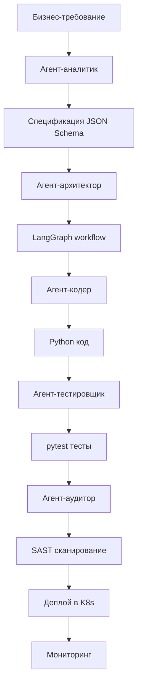

[🏠 Главная](../../README.md) | [📑 Навигация](./INDEX.md) | [📖 Глоссарий](../asc-roadmap/GLOSSARY.md)

---

# ASC AI Fabrique - Обзор концепции и принципов

## 📌 Executive Summary

**ASC AI Fabrique** — это мета-генеративная фабрика цифровых сотрудников (ИИ-агентов), построенная на парадигме **Agentic Swarm Coding**. Система способна автономно проектировать, кодировать, тестировать и разворачивать ИИ-агентов по текстовому бизнес-описанию.

### 🎯 Ключевое преимущество
**От человека + ИИ-ассистента к рою специализированных ИИ-агентов**:
- ✅ **10x ускорение** разработки  
- ✅ **5x снижение стоимости**  
- ✅ **Полная автономия** на 70% задач  
- ✅ **Регуляторное соответствие** из коробки

---

## 🏗️ Архитектурные принципы

### 1. Рекурсивная самоприменимость
Фабрика использует те же паттерны для создания агентов, которые применяла для собственного развития.

```
Метаблок → Агент → Улучшение метаблока
          ↑                           ↓
      Самоприменение              Эволюция
```

### 2. Специализированные рои агентов
Не один универсальный агент, а рой узкоспециализированных:

| Роль агента | Функция | Инструменты |
|-------------|----------|------------|
| **Агент-архитектор** | Проектирование систем | LangGraph, Mermaid |
| **Агент-кодер** | Генерация кода | Qwen3-Coder, Pydantic |
| **Агент-тестировщик** | Создание тестов | pytest, DeepEval |
| **Агент-аудитор** | Проверка безопасности | SAST, OPA |
| **Агент-оркестратор** | Координация работы | Redis, State Management |

### 3. Формализованный опыт (Metablocks)
Реестр повторно используемых паттернов:

```json
{
  "AGENT_DEVELOPMENT_PATTERN": {
    "category": "DEVELOPMENT",
    "workflow": ["Анализ", "Проектирование", "Код", "Тесты", "Деплой"],
    "ai_acceleration": "5-10x"
  },
  "POC_DEFENSE_PATTERN": {
    "category": "PRESENTATION", 
    "workflow": ["Подготовка", "Демо", "Защита"],
    "ai_acceleration": "4-8x"
  }
}
```

---

## 🔄 Паттерны оркестрации

### 1. Мета-генеративный рой (КЛЮЧЕВОЙ)
**Рой-разработчик → готовый агент**
- Агент-аналитик декомпозирует задачу
- Агент-архитектор проектирует решение  
- Агент-кодер реализует функционал
- Агент-тестировщик обеспечивает качество

### 2. Конвейерная сборка
Стандартизация подзадач:
- Генерация Python-клиента по OpenAPI
- Создание Docker-образов
- Автоматическое CI/CD

### 3. Иерархическая команда
Декомпозиция сложных систем:
- «Рой финансовых советников»
- Агент-аналитик + новостник + риск-менеджер

### 4. Диалоговая рефлексия
Этические границы через консенсус:
- Агент-Этик + Агент-Юрист → правила эскалации

---

## 🚀 Технологический стек

### Core Technologies
```yaml
orchestration:
  framework: LangGraph
  state_management: Redis
  checkpointing: Redis
  
models:
  primary: Qwen3-Coder-480B
  fallback: GLM-4.5
  local: Qwen3-32B-AWQ
  
infrastructure:
  containerization: Docker
  orchestration: Kubernetes
  monitoring: Prometheus + Grafana
  
security:
  scanning: SAST (Bandit)
  policies: OPA/Rego
  compliance: 152-ФЗ автоматизация
```

### Development Workflow


---

## 📈 Экономика и метрики

### Базовые показатели (2026)
| Метрика | Значение |
|---------|----------|
| **Инвестиции** | 118.7 млн ₽ |
| **Экономия** | ≥120.6 млн ₽ |
| **ROI (2026)** | +1.6% |
| **Окупаемость** | 12 месяцев |
| **Целевых агентов** | 30+ к декабрю 2026 |

### Ускорение по категориям задач
| Задача | Базовое время | С ИИ | Ускорение |
|---------|---------------|--------|-----------|
| **Исследование** | 100% | 20-30% | 3.3-5x |
| **Архитектура** | 100% | 40-50% | 2-2.5x |
| **Кодирование** | 100% | 10-30% | 3.3-10x |
| **Тестирование** | 100% | 20-30% | 3.3-5x |
| **Документация** | 100% | 10-20% | 5-10x |
| **Презентация** | 100% | 12-25% | 4-8x |

---

## 🛡️ Безопасность и комплаенс

### Автоматическая проверка на 152-ФЗ
- **Анонимизация данных** перед обработкой
- **Логирование всех действий** с привязкой к workflow_id
- **Изолированное выполнение** в Docker-контейнерах
- **Аудит цепочек рассуждений** для traceability

### Enterprise-grade безопасность
```yaml
security_layers:
  code_level:
    - SAST сканирование
    - Уязвимости OWASP Top 10
    - Статический анализ безопасности
  
  infrastructure_level:
    - Изолированные контейнеры
    - Network policies
    - RBAC в Kubernetes
    
  data_level:
    - Шифрование персональных данных
    - Автоматическая анонимизация
    - Политики хранения данных
```

---

## 🎯 Бизнес-ценность

### Прямые выгоды
1. **Сокращение Time-to-Market**
   - Традиционно: 2-3 месяца на агента
   - С ASC Fabrique: 2-8 часов

2. **Снижение стоимости разработки**
   - Традиционно: 2.5 млн ₽/агент
   - С ASC Fabrique: 0.45 млн ₽/агент

3. **Масштабирование команды**
   - 1 человек → 30+ агентов/год
   - Экономия: 15.75 FTE/год

### Стратегические преимущества
- **Технологический ров**: Уникальная способность производить ИИ-агентов быстрее, чем конкуренты могут нанимать людей
- **Компетенций центр**: Накопление паттернов и экспертизы в создании агентов
- **Платформа для монетизации**: Возможность продажи агентных решений другим компаниям

---

## 🚀 Дорожная карта реализации

### Фаза 0: MVP0 (Январь–Апрель 2026)
**Цель**: Доказательство концепции
- [ ] Базовый рой из 4 агентов
- [ ] Демонстрация: описание → агент за 2 часа
- [ ] Defense Gate с ROI-расчетом

### Фаза 1: Бета-фабрика (Май–Октябрь 2026)  
**Цель**: 30+ агентов в продакшене
- [ ] Развитие команды из 12 человек
- [ ] Промышленная эксплуатация
- [ ] CI/CD автоматизация

### Фаза 2: Масштабирование (Ноябрь–Декабрь 2026)
**Цель**: Автономная фабрика
- [ ] Самосовершенствование метаблоков
- [ ] Автоматическая оптимизация
- [ ] Подготовка к 2027

---

## 🔮 Будущее развитие

### Уровень 1: Внутренняя платформа (2027)
- **200+ агентов** по всем подразделениям
- **Agent Marketplace** для самообслуживания
- **Multi-tenancy** изоляция по департаментам

### Уровень 2: Корпоративная платформа (2028+)
- **Low-Code Studio** для бизнес-аналитиков
- **Agent Governance** версионирование и canary-релизы
- **Enterprise интеграция** с 1С, SAP, CRM

### Уровень 3: Внешний рынок (2028+)
- **AIAAS SaaS** для SMB сектора
- **White Label** решения для крупных корпораций
- **Монетизация** платформы как сервиса

---

## 📚 Связанные документы

### Концептуальные
- [📖 ASC AI Fabrique - Концепция автономной фабрики цифровых сотрудников](ASC%20AI%20Fabrique%20-%20Концепция%20автономной%20фабрики%20цифровых%20сотрудников.md)
- [📋 Детализированный список задач и требуемой экспертизы](Детализированный%20список%20задач%20и%20требуемой%20экспертизы%20для%20реализации%20фабрики%20ИИ-агентов.md)
- [🔧 План действий по созданию фабрики](План%20действий%20по%20созданию%20фабрики%20ИИ%20агентов%20по%20концепции%20Agentic%20Swarm%20Coding.md)

### Технические
- [🏗️ Стратегическая дорожная карта](../asc-roadmap/strategic_roadmap.md)
- [🔧 Реестр метаблоков](../asc-roadmap/meta_block_registry.md)
- [📊 AI инструменты стратегия](../asc-roadmap/ai_tools_strategy.md)

### Презентации
- [📊 Презентация концепции](Презентация%20Agentic%20Swarm%20Coding.%20Агентное%20Роевое%20Программирование.html)
- [💡 Вайб-кодинг презентация](Презентация%20Вайб-кодинг%20ИИ%20агентов.html)

---

## 🎯 Ключевые выводы

1. **ASC AI Fabrique** — это не улучшение existing tools, а **следующая ступень эволюции** в разработке ИИ-систем
2. **Agentic Swarm Coding** позволяет достичь **экспоненциального роста** через рекурсивную самоприменимость
3. **Экономический ROI** достигается уже в первый год (октября 2026 — break-even)
4. **Технологический ров** создаёт **уникальное конкурентное преимущество** для российской финтех-корпорации
5. **Платформа готова** к масштабированию и внешней монетизации с 2028 года

**Следующие шаги**: Начать подготовительный этап в ноябре 2025 для запуска MVP0 в январе 2026.

---

*[🏠 Главная](../../README.md) | [📑 Навигация](./INDEX.md) | [📖 Глоссарий](../asc-roadmap/GLOSSARY.md)*
