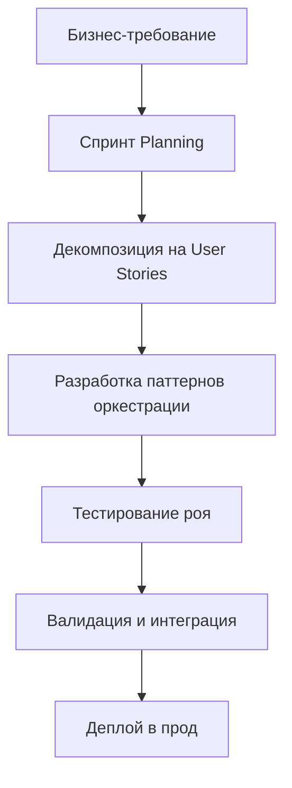

Created: 021020251553
Tags  #1quest 
# Проектная документация Agile подход реализации фабрики ИИ агентов по концепции Agentic Swarm Coding


# ПРОЕКТНАЯ ДОКУМЕНТАЦИЯ  
## Agile-разработка фабрики конвейера на основе Agentic Swarm Coding

---

### 1. ВИДЕНИЕ И ЦЕЛИ

#### 1.1. Стратегическое видение  
Создать полностью автоматизированную enterprise-платформу для генерации ИИ-агентов с гарантированной безопасностью, наблюдаемостью и интеграцией в корпоративный ИТ-ландшафт.

#### 1.2. Ключевые цели (SMART)  
- **Q1 2026**: Запуск MVP0 фабрики с базовым Мета-генеративным роем  
- **Q4 2026**: Промышленная эксплуатация и полная автоматизация  
- **Q1 2027**: Расширение возможностей (дорожная карта)  
- **2028+**: Самоулучшающиеся системы и эволюционирующие агенты  

---

### 2. AGILE-ФРЕЙМВОРК И МЕТОДОЛОГИЯ

#### 2.1. Выбранная методология  
**Hybrid Agile (Scrum + Kanban)**  
- **Спринты**: 2-недельные итерации для MVP и Фазы 1  
- **Kanban**: Управление потоком разработки агентов (CI/AD)  
- **Retrospectives**: Еженедельные для оценки качества генерации  

#### 2.2. Цикл разработки агента  


---

### 3. ПРОДУКТ И АРТЕФАКТЫ

#### 3.1. Продуктовая backlog (MVP0)  
| ID | User Story | Acceptance Criteria | Priority |
|----|-------------|---------------------|----------|
| AS-01 | Как бизнес-аналитик, я хочу генерировать спецификации для новых агентов через текстовый промпт | Рой выдает структурированный JSON с целями, инструментами, KPI | High |
| AS-02 | Как DevOps, я хочу автоматическую сборку Docker-образов для агентов | Интеграция с Kubernetes, CI/AD конвейер | High |
| AS-03 | QA, я хочу валидацию поведения агентов на синтетических данных | Автоматические тесты с pytest + метрики успеха | High |

#### 3.2. Ключевые артефакты  
- **Agent Canvas**: Стандарт описания агентов (JSON Schema)  
- **Orchestration Patterns**: Реализация 4 паттернов (Meta-swarm, Pipeline, Hierarchy, Reflection)  
- **Agent Genome**: Библиотека переиспользуемых компонентов  

---

### 4. РОЛИ И ОБЯЗАННОСТИ

#### 4.1. Scrum команда  
| Роль | Ответственность | Ключевые навыки |
|------|-----------------|-----------------|
| Product Owner | Управление бэклогом, приоритезация | Бизнес-анализ, финтех |
| Scrum Master | Фасилитация спринтов, устранение блокеров | Agile-coaching, DevOps |
| Agentic Engineer | Разработка паттернов оркестрации | Python, LLM orchestration |
| Swarm Architect | Проектирование многоагентных систем | System design, AI/ML |
| Swarm Validator | Тестирование и валидация агентов | QA, synthetic data generation |

#### 4.2. Роли агентов в фабрике  
| Агент | Задача | Инструменты |
|-------|--------|-------------|
| Бизнес-аналитик | Декомпозиция требований | NLP, knowledge base |
| Промпт-инженер | Генерация системных промптов | Prompt engineering |
| Инженер по инструментам | Интеграция API | Python, git |
| Валидатор | Тестирование поведения | pytest, synthetic data |
| Сборщик | Упаковка в Docker | Docker, Kubernetes |

---

### 5. СПРИНТЫ И ДОРОЖНАЯ КАРТА

#### 5.1. Дорожная карта 2026-2027

| Квартал | Фаза | Цель | Достижения |
|---------|------|------|------------|
| **Q4 2025** | Подготовка | Формирование команды и инфраструктура | - Центр компетенций (5-7 инженеров)<br>- Выбор пилотного проекта (email-агент) |
| **Q1 2026** | MVP0 | Запуск базовой фабрики | - Meta-swarm для простых агентов<br>- CI/AD конвейер<br>- 1 пилотный агент (email classification) |
| **Q2 2026** | Масштабирование | Расширение возможностей | - Поддержка сложных агентов<br>- Геном агента<br>- 3+ бизнес-агента в проде |
| **Q3 2026** | Оптимизация | Повышение надежности | - Автоматическая валидация<br>- Мониторинг качества<br>- Снижение cost per agent на 30% |
| **Q4 2026** | Промышленная эксплуатация | Полная автоматизация | - Enterprise-платформа<br>- Интеграция с корпоративным ландшафтом<br>- Магазин агентов |
| **Q1 2027** | Расширение (дорожная карта) | Среднесрочные цели | - Иерархические команды экспертов<br>- Диалоговая рефлексия<br>- 10+ агентов в экосистеме |

#### 5.2. Спринт планирование (пример)  
**Спринт 1 (Q1 2026)**:  
- Цель: "Создать фабрику для email-агента"  
- Stories: AS-01, AS-02, AS-03  
- Definition of Done:  
  - Рой генерирует спецификацию за < 30 мин  
  - Docker-образ собирается автоматически  
  - Тесты проходят > 90%成功率  

---

### 6. МЕТРИКИ И KPI

#### 6.1. Ключевые метрики успеха  
| Метрика | Базовое значение | Цель Q4 2026 | Инструмент измерения |
|---------|------------------|--------------|----------------------|
| Time-to-New-Agent | Кварталы | < 3 дня | CI/AD pipeline metrics |
| Agent Generation Success Rate | 50% | > 85% | Swarm Validator logs |
| Cost per Agent | $X,XXX | < $XXX | Financial tracking |
| Business Value per Agent | $0 | $XX,XXX/month | Business impact analysis |

#### 6.2. Dashboard мониторинга  
- Визуализация потока генерации агентов  
- Метрики качества (тесты, production bugs)  
- ROI от внедренных агентов  

---

### 7. РИСКИ И МИГИГАЦИИ

| Риск | Вероятность | Влияние | Митигация |
|------|-------------|---------|-----------|
| Нестабильность генерации | Высокое | Высокое | Параллельные рои + vote mechanism |
- Проблемы безопасности | Среднее | Критическое | Агент-этик + юридический аудит |
- Интеграция с legacy | Среднее | Высокое | Адаптеры + API gateway |
- Сопротивление изменениям | Низкое | Среднее | Change management программа |

---

### 8. ПРИЛОЖЕНИЯ

#### 8.1. Пример User Story для сложного агента  
**User Story**: Как финансовый аналитик, я хочу рой из 3 агентов (аналитик, новостник, риск-менеджер) для автоматического мониторинга портфеля  
**Acceptance Criteria**:  
- Рой генерируется за 2 часа  
- Агенты обмениваются данными через общий контекст  
- Система эскалации при рисках > 7%  

#### 8.2. Паттерн "Диалоговая рефлексия" (пример)  
```python
# Пример диалога для этических границ
agents = [Agent("Этик"), Agent("Прагматик"), Agent("Юрист")]
discussion = EthicsReflexionChain(agents).discuss(
    topic="Финансовые советы клиентам",
    constraints=["безопасность", "соответствие регуляторике"]
)
prompt = discussion.generate_final_prompt()
```

---

**Версия документа**: 1.0  
**Дата**: 25.09.2025  
**Ответственный**: Product Owner, Agentic Swarm Coding Factory  

--- 
*Документ разработан в соответствии с лучшими практиками Agile и спецификой Agentic Swarm Coding. Будет обновляться по мере прогресса проекта.*
__
### Reference
1. 

__
### Zero Links
1. [[00 Нейросети]]
2. [[00 Development]]
3. [[00 Продуктивность]]
4. [[00 Проекты]]
5. [[00 Prompt Engineering (Промпт Инжиниринг)]]
6. [[00 Сбер]]

__
### Links
1. [[Вайб-кодинг Vibe-coding]] 
2. [[Презентация Вайб-кодинг ИИ агентов]]
3. [[Краткое описание презентации "Вайб кодинг AI агентов"]]
4. [[Роевая агентная разработка. Agentic Swarm Coding]]
5. [[Презентация Agentic Swarm Coding. Агентное Роевое Программирование. Трансформация разработки ИИ агентов]]
6. [[Руководство по созданию Agentic Swarm Coding. Агентное Роевое Программирование. Трансформация разработки ИИ агентов]]
7. [[Итоговый список задач и требуемой экспертизы для реализации фабрики ИИ-агентов на основе концепции Agentic Swarm Coding]]
8. [[Детализированный список задач и требуемой экспертизы для реализации фабрики ИИ-агентов на основе концепции Agentic Swarm Coding]]
9. [[Agile подход реализации фабрики ИИ агентов по концепции Agentic Swarm Coding]]
10. [[План действий по созданию фабрики ИИ агентов по концепции Agentic Swarm Coding]]